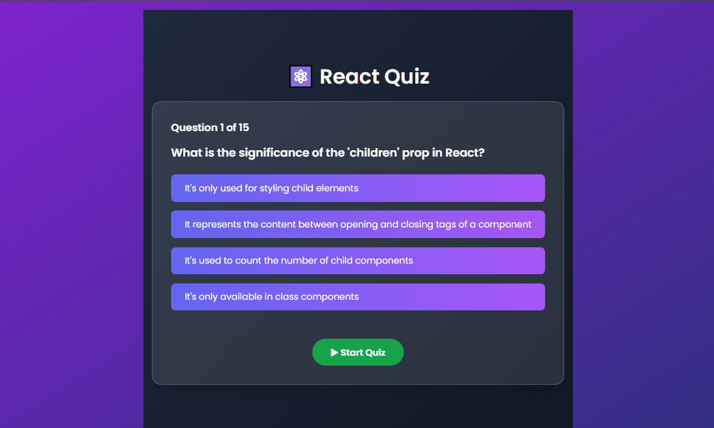

# 🧠 Quiz App

## 📌 Project Description

This is a dynamic and engaging **Quiz App** developed using **React.js**, designed to provide an interactive learning experience by fetching quiz questions from a public **Trivia API**.

The app features a responsive and visually appealing user interface that allows users to select answers, view instant feedback, and track their real-time score. It’s designed to be intuitive, making it suitable for users of all age groups.

---

## ✅ Key Features

- ❓ Fetches quiz questions dynamically from an API  
- ⏱️ Real-time score tracking and instant answer feedback  
- 📋 Multiple-choice questions with smooth navigation  
- 🌓 Toggle between **Dark and Light Mode**  
- ⚡ Built with **React.js** for a dynamic, component-driven UI  
- 📱 Fully responsive design – compatible across all devices  

This project sharpened my skills in API integration, user state management, and creating interactive components in React.

---

## 🛠️ Tech Stack

- **Frontend**: React.js, Tailwind CSS  
- **API**: Open Trivia DB (or any Trivia API you used)  
- **Deployment**: GitHub Pages  

---

## 🚀 Live Demo

👉 [Click here to view the project](https://tahir1605.github.io/Quize-app/)  

---

## 📚 Learning Highlights

- React Hooks (useState, useEffect)
- Conditional rendering
- Responsive layout with Tailwind CSS
- API calls and data handling
- Theme toggling (Dark/Light mode)

---

